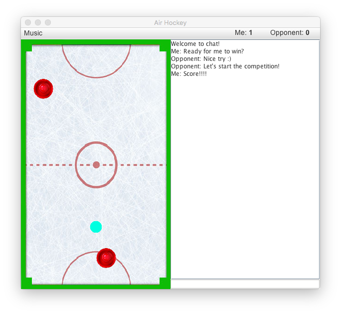

# AirHockey

A multi-player networked air hockey game.

On separate terminals, players interact seamlessly with joint game instance.  
Uses Java sockets for network communications.  

Features include:
- Full hockey game implementation
- Integrated chat function
- User-controlled background music

## Downloading

A runable .jar file is available for download [here](AirHockey.jar).
